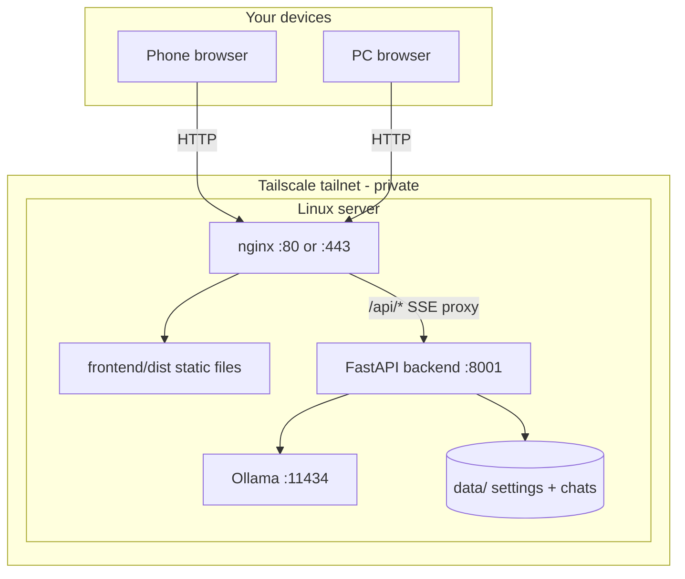

# TinyLM Council — Linux Server Setup Guide

Deploy TinyLM Council and Ollama on a single Linux server, with optional Tailscale access from your phone or PC.

## Architecture



## Quick install

```bash
# Ollama
curl -fsSL https://ollama.com/install.sh | sh
ollama pull qwen2.5:0.5b

# App
cd /opt
git clone https://github.com/Tjjordan3/tinylm-council.git
cd tinylm-council
python3 -m venv .venv && source .venv/bin/activate
pip install -r requirements.txt
cd frontend && npm install && npm run build && cd ..
```

## Requirements

- Linux (Ubuntu 22.04+ recommended)
- Python 3.10+, Node.js 18+ (for building frontend)
- [Ollama](https://ollama.com/)
- [Tailscale](https://tailscale.com/) (recommended)
- nginx (production)

## 1. Install Ollama

```bash
curl -fsSL https://ollama.com/install.sh | sh
sudo systemctl enable ollama
sudo systemctl start ollama
```

Pull starter models:

```bash
ollama pull qwen2.5:0.5b
ollama pull phi3:mini
ollama pull gemma2:2b
```

Verify:

```bash
curl http://localhost:11434/api/tags
```

Keep Ollama on `localhost` unless you have a specific reason to expose it. Only expose TinyLM Council through Tailscale/nginx.

## 2. Install TinyLM Council

```bash
cd /opt
git clone https://github.com/Tjjordan3/tinylm-council.git
cd tinylm-council

python3 -m venv .venv
source .venv/bin/activate
pip install -r requirements.txt

cd frontend
npm install
npm run build
cd ..
```

Optional cloud models:

```bash
cp .env.example .env
# Edit .env — set OPENROUTER_API_KEY if needed
```

## 3. Configure Ollama URLs

In the web UI under **Settings → Providers**, or in `data/settings.json`:

| Field | Same-server value |
|-------|-------------------|
| base_url | `http://localhost:11434/v1` |
| native_base_url | `http://localhost:11434` |

**Both must use the same host.** Wrong `native_base_url` breaks model listing in the UI.

## 4. Run the backend

Test manually:

```bash
source .venv/bin/activate
python -m backend.main
```

Expected: `Uvicorn running on http://0.0.0.0:8001`

### systemd service

Create `/etc/systemd/system/tinylm-council.service`:

```ini
[Unit]
Description=TinyLM Council API
After=network.target ollama.service
Wants=ollama.service

[Service]
Type=simple
User=YOUR_USER
WorkingDirectory=/opt/tinylm-council
Environment=PATH=/opt/tinylm-council/.venv/bin:/usr/bin
ExecStart=/opt/tinylm-council/.venv/bin/python -m backend.main
Restart=on-failure
RestartSec=5

[Install]
WantedBy=multi-user.target
```

Enable:

```bash
sudo systemctl daemon-reload
sudo systemctl enable tinylm-council
sudo systemctl start tinylm-council
```

## 5. nginx (production)

Install nginx:

```bash
sudo apt install nginx
```

Create `/etc/nginx/sites-available/tinylm-council`:

```nginx
server {
    listen 80;
    server_name _;

    root /opt/tinylm-council/frontend/dist;
    index index.html;

    location / {
        try_files $uri $uri/ /index.html;
    }

    location /api/ {
        proxy_pass http://127.0.0.1:8001;
        proxy_http_version 1.1;
        proxy_set_header Host $host;
        proxy_set_header X-Real-IP $remote_addr;

        # Required for council SSE streaming
        proxy_buffering off;
        proxy_cache off;
        proxy_read_timeout 600s;
        proxy_send_timeout 600s;
    }
}
```

Enable:

```bash
sudo ln -s /etc/nginx/sites-available/tinylm-council /etc/nginx/sites-enabled/
sudo nginx -t
sudo systemctl reload nginx
```

Council runs with several models can take **5–15+ minutes**. Long proxy timeouts are required.

## 6. Access from your phone (Tailscale)

```bash
tailscale ip -4
```

On your phone (same tailnet): `http://100.x.x.x`

Add to Home Screen for a PWA shortcut.

**Security:** The app has no built-in login. Use Tailscale or a VPN — do not expose ports to the public internet without authentication.

## 7. First-time app configuration

1. Open the web UI and complete the setup wizard.
2. **Settings** → **Tiny** profile.
3. Enable **2+ council members**; pick an **instruct** model as chairman.
4. Save and ask a short test question.

Use **Stop** if a run hangs. Only one council run at a time.

## 8. Remote Ollama (optional)

If Ollama stays on another machine:

```
base_url:         http://OTHER_HOST:11434/v1
native_base_url:  http://OTHER_HOST:11434
```

The Council server must reach that host (e.g. over Tailscale).

## 9. Dev mode (temporary)

Not recommended for production:

```bash
# Terminal 1
source .venv/bin/activate && python -m backend.main

# Terminal 2
cd frontend && npm run dev
```

Open `http://SERVER_TAILSCALE_IP:5173`.

## 10. Troubleshooting

| Issue | Fix |
|-------|-----|
| Models not listed | Fix `native_base_url` to match `base_url` host |
| Run never finishes | nginx SSE settings; one request at a time |
| Stage 1 missing in UI | Refresh or reopen conversation |
| One model fails | Remove from council or pull in Ollama |
| CORS errors | Serve frontend and API from same origin via nginx |

**Logs:**

```bash
sudo journalctl -u tinylm-council -f
sudo journalctl -u ollama -f
```

## 11. Backup and update

**Backup** the `data/` directory (settings + conversations).

**Update:**

```bash
cd /opt/tinylm-council
git pull
source .venv/bin/activate && pip install -r requirements.txt
cd frontend && npm install && npm run build
sudo systemctl restart tinylm-council
sudo systemctl reload nginx
```

## See also

- [Windows setup guide](WINDOWS_SETUP.md)
- [Main README](../README.md)
