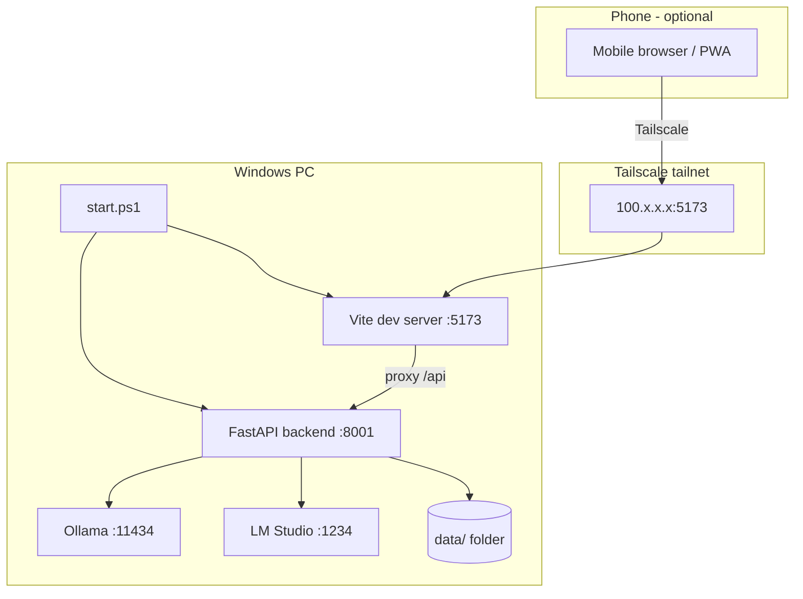

# TinyLM Council — Windows Setup Guide

Run TinyLM Council on your Windows PC with Ollama or LM Studio, and optionally access it from your phone over Tailscale.

## Architecture



## Requirements

- **Windows 10/11**
- **Python 3.10+** — [python.org](https://www.python.org/downloads/) (check "Add to PATH")
- **Node.js 18+** — [nodejs.org](https://nodejs.org/)
- **Ollama** and/or **LM Studio** for local models
- **Tailscale** (optional, for phone access) — [tailscale.com/download](https://tailscale.com/download)

## Quick start

### 1. Clone the repo

```powershell
git clone https://github.com/Tjjordan3/tinylm-council.git
cd tinylm-council
```

### 2. Install Ollama and pull models

Install from [ollama.com](https://ollama.com/), then:

```powershell
ollama pull qwen2.5:0.5b
ollama pull phi3:mini
```

### 3. Install app dependencies

**Backend:**

```powershell
python -m pip install -r requirements.txt
```

Or with [uv](https://docs.astral.sh/uv/): `uv sync`

**Frontend:**

```powershell
cd frontend
npm install
cd ..
```

### 4. Optional — cloud models

```powershell
copy .env.example .env
```

Edit `.env` and set `OPENROUTER_API_KEY` if you use OpenRouter.

For **web search** (optional), add a free [Serper](https://serper.dev) API key in **Settings → Web search**, or in `.env`:

```env
SERPER_API_KEY=your-key-here
```

### 5. Run

```powershell
.\start.ps1
```

Run from **PowerShell** in the project folder. Use `.\start.ps1` (not `start start.ps1` — that opens the file in Notepad).

Open **http://localhost:5173** in your browser.

`start.ps1` starts the backend (`:8001`) and frontend (`:5173`). If Tailscale is installed, it prints your mobile URL automatically.

## First-time configuration

1. Complete the **setup wizard** (Ollama-only is fine).
2. Go to **Settings**:
   - **Council profile:** Tiny (best for 0.5–4B models)
   - Apply **Tiny local council** preset, **Mini coding council** for code tasks, or enable 2+ models you have installed
   - Pick a **chairman** — use an **instruct/chat** model, not a base model
   - Click **Save changes**
3. Ask a short test question (e.g. "What is the capital of France?").

### Ollama on a remote server

If Ollama runs on another machine (e.g. over Tailscale), set **both** URLs in Settings → Providers → Ollama (both fields are editable in the UI):

| Field | Example |
|-------|---------|
| base_url | `http://100.x.x.x:11434/v1` |
| native_base_url | `http://100.x.x.x:11434` |

Both must use the **same host**. Mismatched `native_base_url` causes models to not appear in the UI. Editing `base_url` auto-updates `native_base_url` when it is still the localhost default.

## Phone access (Tailscale)

1. Install Tailscale on your **PC** and **phone** (same account).
2. Run `.\start.ps1` on the PC.
3. Allow Windows Firewall for port **5173** if prompted.
4. On the PC: `tailscale ip -4` — note the `100.x.x.x` address.
5. On your phone browser: `http://100.x.x.x:5173`
6. Optional: **Add to Home Screen** for a PWA shortcut.

Inference still runs on the PC (or wherever your Ollama server is configured). The phone is a remote browser.

## Using the app

- **Stop button** — appears while a consultation runs; cancels the current council and clears partial results.
- **One at a time** — wait for a run to finish (or stop it) before sending another question.
- **Failed models** — one bad model does not stop the council; remove unreliable models in Settings.
- **Web search** — check **Search the web first** before sending; add your Serper key in **Settings → Web search** or in `.env` ([serper.dev](https://serper.dev), ~2,500 free searches/month). Sources show in the **Web sources** panel. Council still runs if the key is missing (with a warning).
- **Delete chats** — hover a conversation in the sidebar and click **×** (always visible on mobile).

### NVIDIA NIM (optional cloud models)

1. Get a free API key at [build.nvidia.com/models](https://build.nvidia.com/models).
2. In **Settings → NVIDIA NIM**, paste the key and click **Test connection**.
3. Under **Providers**, click **+ NVIDIA NIM** and **Save changes**.
4. Open **Models → Cloud → NVIDIA NIM** to browse the full catalog (including large models).
5. Apply **NVIDIA cloud council** preset (Llama 8B, Gemma 9B, Phi-3 Mini), or browse **Models → Cloud** for larger models.

## Manual start (without start.ps1)

**Terminal 1 — backend:**

```powershell
python -m backend.main
```

**Terminal 2 — frontend:**

```powershell
cd frontend
npm run dev
```

## LM Studio

1. Start the LM Studio local server (default port **1234**).
2. In Settings, add or configure the LM Studio provider.
3. Use **Models** in the app to download/load models (LM Studio 0.4+ native API).
4. Set `LM_API_TOKEN` in `.env` if authentication is enabled.

## Troubleshooting

| Problem | Fix |
|---------|-----|
| Port 5173 or 8001 in use | Stop the old process or restart the PC; `start.ps1` warns if ports are busy |
| Models not listed | Set `native_base_url` to match `base_url` host |
| Council never finishes | Use **Stop**, then retry; enable **Parallel Ollama requests** in Settings for remote Ollama; use 2–3 members |
| Council very slow (remote Ollama) | Enable **Parallel Ollama requests** in Settings; set `OLLAMA_KEEP_ALIVE` on the Ollama host to reduce model reload time |
| Web search feels slow | Normal Serper latency is 1–5s; Tiny profile now uses fewer results; council time dominates after search |
| Stage 1 missing in UI | Refresh the page or reopen the conversation |
| `start.ps1` parse error | Update to latest `main` — Unicode dash issue was fixed |
| Mobile can't connect | Check Tailscale on both devices; allow firewall on port 5173 |
| `npm` not found | Install Node.js LTS from [nodejs.org](https://nodejs.org), reopen PowerShell |
| `start.ps1` opens Notepad | Run `.\start.ps1` in PowerShell, not `start start.ps1` |
| Web search skipped | Add your Serper key in **Settings → Web search** or in `.env`, then save/restart |

## Data location

Settings and conversations are stored in:

```text
tinylm-council/data/
  settings.json
  conversations/
```

This folder is gitignored. Back it up if you reinstall or move machines.

## Update

```powershell
cd tinylm-council
git pull
python -m pip install -r requirements.txt
cd frontend
npm install
cd ..
```

Then restart with `.\start.ps1`.

## See also

- [Server setup guide](SERVER_SETUP.md) — Linux production deployment with nginx
- [Main README](../README.md)
